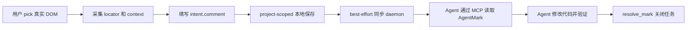
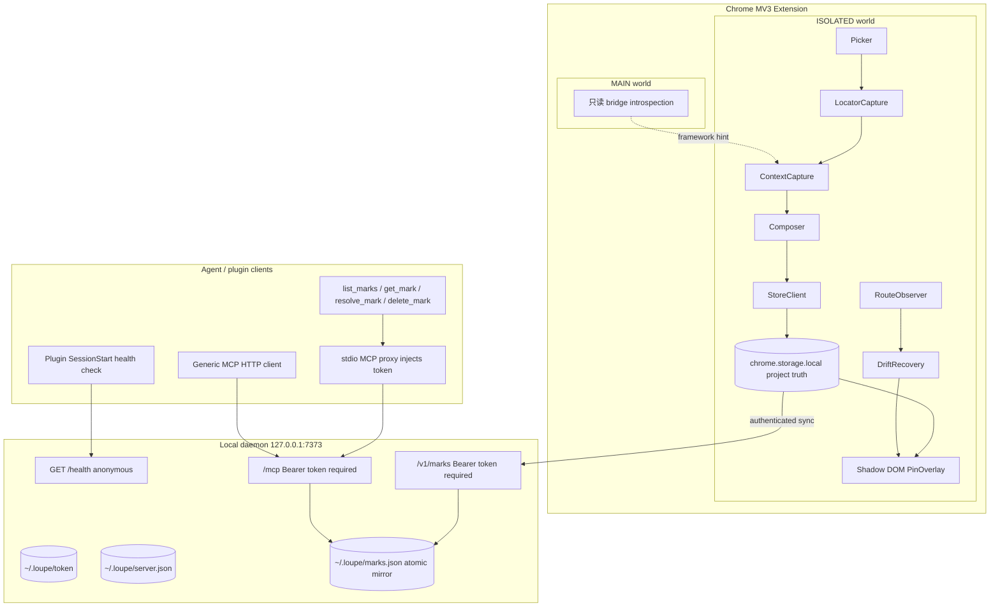
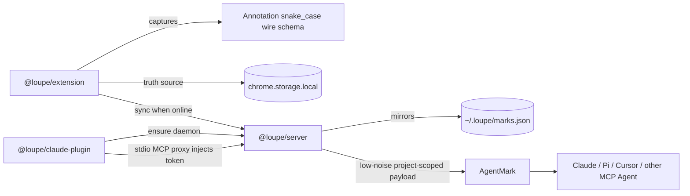
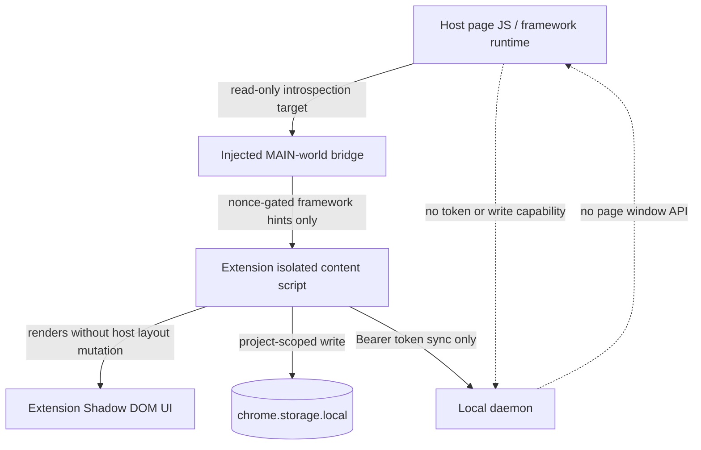
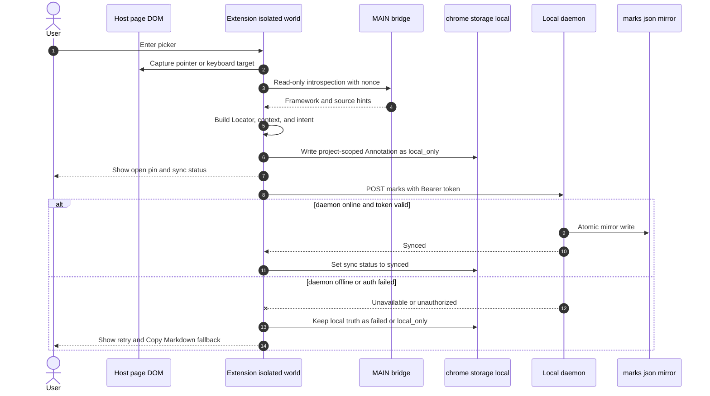
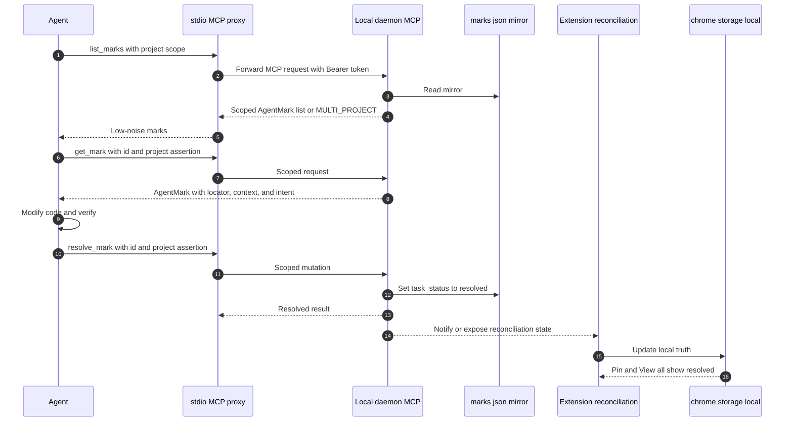
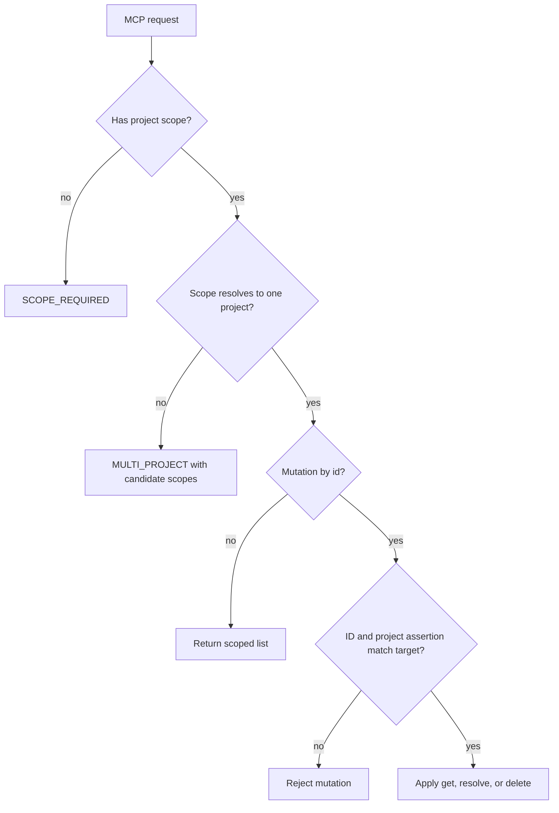
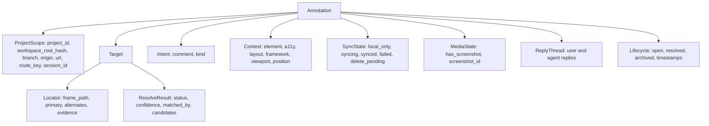
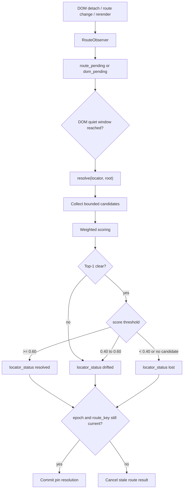

# ADP 20260602 · Loupe 本地优先架构与 Agent 数据流

## Context

Loupe 的核心闭环是：

这个闭环要求 Loupe 不是截图批注工具，也不是页面内设计编辑器，而是把“浏览器中被指到的真实 DOM 元素”转换成 Agent 可定位、可执行、可复核、可完成的结构化任务。

架构上需要同时解决四个问题：

1. **定位可信。** 单 selector 或纯视觉坐标都不够；rerender、route change、DOM detach 后不能静默指错。
2. **本地交互可靠。** daemon 离线时，用户仍必须能保存 mark；页面上的 pin 和 View all 不能依赖 Agent bridge 在线。
3. **Agent 低噪声读取。** raw storage 要保留证据，但 MCP payload 不能把全部内部字段、样式、token、截图 bytes 或错误栈暴露给 Agent。
4. **project/session 隔离。** 同一 `origin` 可能对应多个项目；MCP 读写不能按 URL 或 bare id 混读/误改。

因此当前架构选择围绕三个组件展开：Chrome MV3 extension、本地 daemon、Agent/plugin 包。

## Decision

采用 **Chrome MV3 extension + local-first storage + authenticated local daemon + project-scoped MCP proxy** 架构。

### Component boundaries

- `@loupe/extension`：Chrome MV3；picker、composer、locator/context capture、minimal pin overlay、`chrome.storage.local` 本地优先存储。
- `@loupe/server`：监听 `127.0.0.1:7373`；提供匿名 `/health`、鉴权 `/v1/marks*`、鉴权 `/mcp`，维护 `~/.loupe/marks.json` 镜像。
- `@loupe/claude-plugin`：提供 SessionStart daemon ensure、stdio MCP proxy、`/loupe:marks` 与 `mark-resolver` agent 的最小安装路径。
- `@loupe/shared`：冻结 `Annotation` / `Locator` / `ResolveResult` / `AgentMark` 等 snake_case wire schema 与 locator/recovery 契约。

### Runtime world boundary

Decision details:

1. MAIN world 只做只读框架/组件线索采集；Agent 读写不经过页面 `window` API。
2. Extension UI 全部使用 Shadow DOM，overlay 不插入目标元素内部，不改变宿主布局。
3. daemon 默认固定端口 `7373`；通过 `/health` 判断端口上是否是 Loupe daemon，不用 `pgrep`。
4. daemon 同时支持 MCP-over-HTTP 与 Claude stdio proxy；Claude 插件 proxy 读取 `~/.loupe/token` 后转发到 `/mcp`，避免 `.mcp.json` 明文写 token。

### Mark capture and local-first sync

`chrome.storage.local` 是浏览器交互的真相源。daemon 是 Agent bridge 与磁盘镜像，不是页面内 pin 的唯一依据。这样 daemon 离线时不会阻塞用户继续标注。

### Agent read/resolve flow

MCP 工具必须 project-scoped：

`resolve_mark` 是完成任务的默认闭环；`delete_mark` 只代表用户明确删除并写 tombstone，不代表任务完成。

### Data model and status separation

三个状态维度必须分离：

```mermaid
flowchart TB
  subgraph TaskLifecycle["Task lifecycle"]
    TaskOpen["open"] -->|"resolve_mark or user resolve"| TaskResolved["resolved"]
    TaskOpen -->|"explicit archive or delete"| TaskArchived["archived"]
    TaskResolved -->|"archive"| TaskArchived
  end

  subgraph LocatorResolution["Locator resolution"]
    LocResolved["resolved"] -->|"rerender or route ambiguity"| LocDrifted["drifted"]
    LocDrifted -->|"confidence restored"| LocResolved
    LocResolved -->|"no trustworthy candidate"| LocLost["lost"]
    LocDrifted -->|"no trustworthy candidate"| LocLost
    LocLost -->|"later recovery"| LocResolved
  end

  subgraph SyncStatus["Sync status"]
    SyncLocal["local_only"] --> Syncing["syncing"]
    Syncing --> Synced["synced"]
    Syncing --> SyncFailed["failed"]
    SyncFailed -->|"retry"| Syncing
    Synced -->|"explicit delete tombstone"| DeletePending["delete_pending"]
  end
```

`task_status=resolved` 不表示当前 DOM 还能定位；`locator_status=lost` 也不表示任务未完成；`sync.status=failed` 不删除本地 mark。

### Locator recovery data flow

Locator 保存多证据 bundle，而不是只保存 selector。Primary selector 唯一命中也必须验证 tag 与至少一个采集时存在的 text/role/stable attr 证据；geometry 只作 sanity check。

## Alternatives considered

### 1. 只做截图/视觉坐标批注

优点：实现快，跨页面结构变化时不需要 DOM schema。

缺点：Agent 只能看到视觉描述，仍要猜组件/文件；无法可靠表达 Shadow DOM、iframe、a11y name、framework hint、locator drift；也无法形成 `resolve_mark` 这种可验证任务闭环。

未采用。

### 2. 只保存单 selector

优点：数据小，MVP 表面简单。

缺点：rerender、CSS module、列表重排、重复元素、route change 后容易误命中；最坏情况不是找不到，而是静默指错。Loupe 的核心原则是“定位即信任”，所以必须保存多证据 locator bundle 并实现 ambiguity downgrade。

未采用。

### 3. daemon 作为唯一真相源

优点：Agent 和浏览器都读同一份 daemon 状态，模型直观。

缺点：daemon 离线会阻塞浏览器标注；插件启动、token、端口占用都会影响页面内交互；用户在本地开发页面上的快速反馈会变成网络/进程可用性问题。

未采用。当前选择 `chrome.storage.local` 为交互真相源，daemon 只做镜像与 Agent bridge。

### 4. 页面注入全功能 MAIN-world API

优点：更容易访问框架 internals，也方便页面主动调用 Loupe。

缺点：宿主页面脚本会靠近 mark 写入能力与 token 边界；框架探测逻辑和 Agent mutation 路径混在页面 runtime 中，安全边界不清晰。

未采用。MAIN world 只读、nonce-gated、一次请求后解绑；写入、存储、同步、UI 都在 isolated world / daemon 侧。

### 5. 动态端口发现替代固定 7373

优点：端口冲突时更灵活。

缺点：插件、MCP proxy、generic client 配置与诊断复杂度上升；MVP 当前更需要清晰、可复用、可失败解释的本地入口。

未采用。MVP 固定 `127.0.0.1:7373`，用 `/health` 判断端口上是否为 Loupe daemon；非 Loupe 占用时明确失败。

### 6. `.mcp.json` 直接写 Bearer token

优点：generic HTTP MCP 配置简单。

缺点：token 明文进入 Agent 配置文件；轮换和泄露面更差。

未作为 Claude 默认路径。Claude 插件使用 stdio MCP proxy 读取本地 token 并转发；generic client 仍可显式配置 HTTP + Authorization。

## Consequences

### Positive

- 浏览器标注不依赖 daemon 在线；daemon 离线时仍能 local-only 保存，并提供 retry / Copy Markdown fallback。
- Agent 读取的是低噪声 `AgentMark`，但 raw `Annotation` 仍保留定位、上下文、同步与生命周期证据。
- Project/session scope 成为 schema、storage key、MCP 工具共同边界，降低同 origin 多项目混读风险。
- `resolve_mark` 形成默认完成闭环，避免把“完成任务”和“删除记录”混成同一操作。
- MAIN/ISOLATED 分工清晰：页面可被只读 introspection，但拿不到无 token 写入口。

### Negative / cost

- Extension 与 daemon 存在双写/镜像/reconciliation 成本，必须维护 sync status、tombstone 与冲突恢复。
- Locator bundle 与 scoring recovery 明显复杂于单 selector，需要离线 robustness suite 标定阈值。
- 固定端口让端口冲突成为显式失败路径；MVP 不自动漂移到随机端口。
- `AgentMark` 与 raw `Annotation` 分层增加 schema 维护成本，但换来 Agent payload 可控。

### Follow-up constraints

- 所有新 schema 字段必须保持 snake_case wire 语义；domain adapter 不能改变持久化含义。
- `/v1/marks*` 与 `/mcp` 的写能力必须始终要求 Bearer token；CORS 不能替代鉴权。
- MCP mutation 必须有 id + project/session assertion；bare-id mutation 不能执行。
- Locator recovery 提交 pin 位置前必须校验 route epoch 与 route_key snapshot，禁止 stale route commit。

## Status

Accepted（部分被 `adp-20260607` 取代：真相源由 `chrome.storage.local` 改为 daemon 权威，
并新增 daemon→extension SSE 推送；本 ADP 其余决策仍然有效。）
