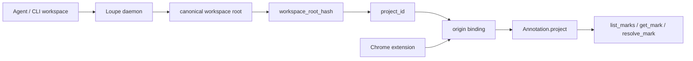
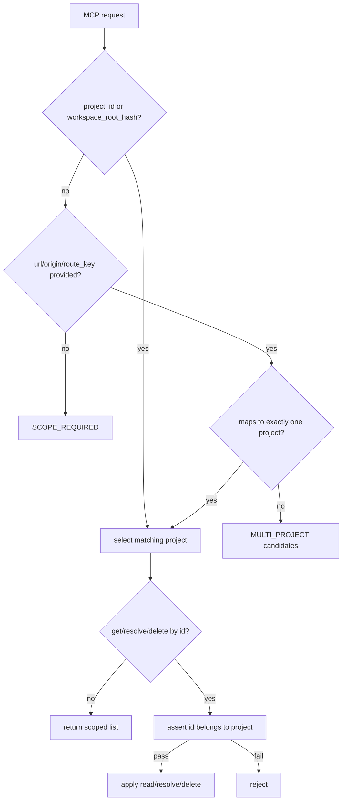

# ADP 20260602 · Loupe workspace-backed project identity

## Context

Loupe mark 的安全边界是 project scope，而不是单个 URL。Agent 读取 mark、执行修改、调用 `resolve_mark` 时，必须知道 mark 属于哪个代码仓库；否则同一个浏览器 origin 下的多个本地项目会被混在一起。

当前扩展实现里，`project_id` 和 `workspace_root_hash` 都由页面 origin 派生：

```text
project_id          = "local_" + fnv1a(location.origin).toString(36)
workspace_root_hash = "origin_" + fnv1a(location.origin).toString(36)
route_key           = pathname + sorted query
session_id          = sessionStorage random id
```

这足以区分不同 host，但不能可靠区分同一个 origin 下的多个 repo：

```text
http://localhost:5173  -> repo A
http://localhost:5173  -> repo B
```

这种碰撞不是边缘情况：前端开发服务经常复用 `localhost:5173`、`localhost:3000`、`127.0.0.1:4173` 等 origin。若 MCP 仅靠 URL/origin 推断 project，Agent 可能读取或 resolve 另一个仓库的 mark。

PRD 已经定义目标方向：`workspace_root_hash` 应来自 workspace root 规范路径；`project_id` 由 daemon/CLI 与扩展共同确认；同一 origin 可以对应多个 `project_id`。这次架构变更需要把该目标变成强制决策，而不是 fallback 说明。

## Decision

采用 **daemon-owned project identity + extension origin binding + scoped Agent reads**。



### Identity ownership

1. **daemon owns durable project identity.**
   - daemon derives `workspace_root_hash` from the Agent/CLI current workspace root after path canonicalization.
   - `project_id` is derived from `workspace_root_hash` plus a project namespace/version, not from browser origin.
   - branch remains optional metadata; it is not part of `project_id`.

2. **extension owns page route identity.**
   - extension still derives `origin`, `url`, and `route_key` from `location`.
   - `route_key` remains `pathname + sorted query` unless a framework route name is available later.
   - extension does not invent a durable workspace identity when a daemon-confirmed project is available.

3. **origin binding connects browser page to daemon project.**
   - extension stores a mapping from authorized page origin to one or more daemon projects.
   - if an origin has exactly one bound project, marks can be created under that `project_id`.
   - if an origin has multiple bound projects, the UI must require project selection before saving a mark.
   - if daemon/project identity is unavailable, extension may create a temporary local project, but it must be visibly temporary and mergeable later.

### Scope fields

The durable project scope becomes:

```ts
type ProjectScope = {
  project_id: string;          // daemon-owned stable id, not origin hash
  workspace_root_hash: string; // hash(canonical workspace root)
  branch?: string;             // optional current branch metadata
  origin: string;              // browser origin
  url: string;                 // full page URL at capture time
  route_key: string;           // pathname + sorted query, later may include app route name
  session_id: string;          // stable route session id, see below
};
```

`session_id` must be deterministic for the project/branch/route tuple when daemon identity is known:

```text
session_id = hash(project_id + "\n" + (branch ?? "") + "\n" + route_key)
```

The old random `sessionStorage` id may remain only for temporary local projects or transient UI state. It must not be the durable session id for daemon-backed marks.

### Agent/MCP implications

MCP reads and mutations remain project-scoped:



Agent tools should prefer `project_id` or `workspace_root_hash`. URL-only lookup is allowed only as a convenience path when it resolves to exactly one project.

## Alternatives considered

### Keep origin-derived `project_id`

Rejected. It is simple and works for demos, but it violates the project/session isolation requirement. Localhost port reuse can cause cross-repo mark reads and cross-repo `resolve_mark` mutations.

### Use `origin + route_key` as project identity

Rejected. It separates routes but still does not identify the code workspace. Two different repos can serve the same route on the same origin, and one repo can serve many routes.

### Use browser tab/session identity as project identity

Rejected. It prevents some accidental mixing but destroys continuity across reloads, tabs, browser restarts, and Agent sessions. Agent needs a stable project key to finish work later.

### Ask the user to manually name every project

Rejected as the primary path. Manual naming is useful as fallback when no daemon workspace is available, but making it the normal path adds friction and creates spelling/duplicate-name failure modes.

### Let the Agent infer project from current working directory without extension binding

Rejected. Agent cwd alone does not tell the extension which browser origin belongs to that workspace, and the same origin can be reused by another workspace later. The binding must be explicit and stored.

## Consequences

Positive:

- Agent mark reads are tied to the actual code workspace, not merely to a browser URL.
- Same-origin multi-repo local development becomes safe: ambiguous URL/origin reads return `MULTI_PROJECT` instead of merged marks.
- `resolve_mark` and `delete_mark` keep a strong project assertion boundary.
- Temporary local-only marking remains possible, but it is no longer confused with durable project identity.

Costs:

- daemon needs a project registry and an origin-binding API/surface.
- extension onboarding must handle project binding, project switching, and ambiguous origin states.
- existing origin-derived marks need migration or compatibility handling.
- tests must cover same-origin/multiple-project ambiguity and deterministic session id generation.

Migration rules:

1. Existing `local_<origin_hash>` projects are treated as temporary legacy projects.
2. When a daemon-backed project is bound to the same origin, UI may offer migration from the legacy project to the daemon project.
3. Server/MCP must continue rejecting unscoped and ambiguous reads; migration must not create a path that merges projects silently.
4. Storage keys remain project-scoped:

```text
loupe:v1:projects:index
loupe:v1:project:{project_id}:sessions:index
loupe:v1:project:{project_id}:session:{session_id}:marks
loupe:v1:project:{project_id}:tombstones
```

## Status

Accepted
