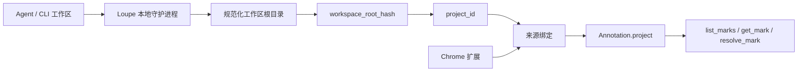
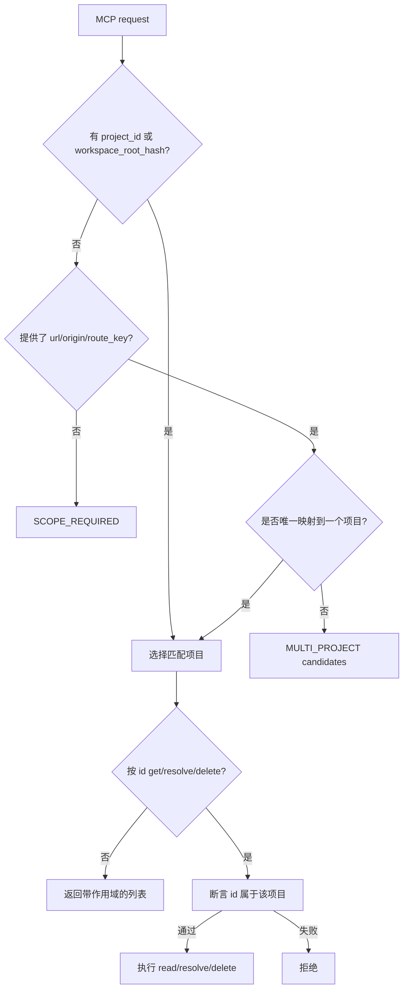

# ADP 20260602 · Loupe 基于工作区的项目标识

## Context

Loupe mark 的安全边界是项目作用域，而不是单个 URL。Agent 读取 mark、执行修改、调用 `resolve_mark` 时，必须知道 mark 属于哪个代码仓库；否则同一个浏览器来源下的多个本地项目会被混在一起。

当前扩展实现里，`project_id` 和 `workspace_root_hash` 都由页面来源派生：

```text
project_id          = "local_" + fnv1a(location.origin).toString(36)
workspace_root_hash = "origin_" + fnv1a(location.origin).toString(36)
route_key           = pathname + sorted query
session_id          = sessionStorage random id
```

这足以区分不同 host，但不能可靠区分同一个来源下的多个 repo：

```text
http://localhost:5173  -> repo A
http://localhost:5173  -> repo B
```

这种碰撞不是边缘情况：前端开发服务经常复用 `localhost:5173`、`localhost:3000`、`127.0.0.1:4173` 等来源。若 MCP 仅靠 URL/来源推断项目，Agent 可能读取或 resolve 另一个仓库的 mark。

PRD 已经定义目标方向：`workspace_root_hash` 应来自工作区根目录的规范路径；`project_id` 由本地守护进程/CLI 与扩展共同确认；同一来源可以对应多个 `project_id`。这次架构变更需要把该目标变成强制决策，而不是兜底说明。

## Decision

采用 **本地守护进程持有项目身份 + 扩展维护来源绑定 + Agent 按作用域读取**。



### 标识归属

1. **本地守护进程持有持久项目身份。**
   - 本地守护进程从 Agent/CLI 当前工作区根目录推断规范路径，并据此生成 `workspace_root_hash`。
   - `project_id` 由 `workspace_root_hash` 加项目命名空间/版本派生，不能由浏览器来源派生。
   - 分支只是可选元数据，不参与 `project_id`。

2. **扩展持有页面路由身份。**
   - 扩展仍从 `location` 派生 `origin`、`url`、`route_key`。
   - `route_key` 默认保持 `pathname + sorted query`；以后如果能获取框架路由名，可以追加框架路由信息。
   - 只要存在本地守护进程确认的项目身份，扩展就不能自行发明持久工作区身份。

3. **来源绑定连接浏览器页面与本地守护进程项目。**
   - 扩展保存“已授权页面来源 -> 一个或多个本地守护进程项目”的绑定关系。
   - 如果某个来源只绑定了一个项目，mark 可以直接用该 `project_id` 创建。
   - 如果某个来源绑定了多个项目，UI 必须要求用户先选择项目，再保存 mark。
   - 如果本地守护进程/项目身份不可用，扩展可以创建临时本地项目，但必须显式标记为临时状态，并且后续可合并到本地守护进程支持的项目。

### 作用域字段

持久项目作用域定义为：

```ts
type ProjectScope = {
  project_id: string;          // 本地守护进程持有的稳定 id，不是来源 hash
  workspace_root_hash: string; // hash(规范化工作区根目录)
  branch?: string;             // 可选当前分支元数据
  origin: string;              // 浏览器来源
  url: string;                 // 捕获时的完整页面 URL
  route_key: string;           // pathname + sorted query，未来可包含应用路由名
  session_id: string;          // 稳定路由 session id，见下文
};
```

当存在本地守护进程身份时，`session_id` 必须按项目/分支/路由元组确定性生成：

```text
session_id = hash(project_id + "\n" + (branch ?? "") + "\n" + route_key)
```

旧的随机 `sessionStorage` id 只能保留给临时本地项目或瞬时 UI 状态，不能作为本地守护进程支持的 mark 的持久 session id。

### Agent / MCP 影响

MCP 读取与变更继续保持项目作用域约束：



Agent 工具应优先传 `project_id` 或 `workspace_root_hash`。只用 URL 查找只能作为便利路径：只有当它能唯一解析到一个项目时才允许继续。

## Alternatives considered

### 保留由来源派生的 `project_id`

拒绝。它简单，适合演示，但违反项目/session 隔离要求。localhost 端口复用会导致跨 repo 读取 mark，甚至跨 repo 执行 `resolve_mark` 变更。

### 使用 `origin + route_key` 作为项目身份

拒绝。它能区分 route，但仍然不能识别代码工作区。两个不同 repo 可以在同一来源提供同一路由；同一个 repo 也可以提供多个 route。

### 使用浏览器 tab/session identity 作为项目身份

拒绝。它可以减少一部分混淆，但会破坏 reload、跨 tab、浏览器重启、Agent session 之间的连续性。Agent 需要稳定 project key 才能稍后完成任务。

### 要求用户为每个项目手动命名

拒绝作为主路径。无本地守护进程工作区时，手动命名可以作为兜底；但如果把它作为常规路径，会增加摩擦，并引入拼写不一致和重复命名问题。

### 只让 Agent 从当前工作目录推断项目，不做扩展绑定

拒绝。Agent 当前工作目录不能告诉扩展哪个浏览器来源属于这个工作区；同一个来源之后也可能被另一个工作区复用。绑定必须显式建立并持久保存。

## Consequences

正面影响：

- Agent mark 读取绑定到真实代码工作区，而不仅是浏览器 URL。
- 同来源多 repo 的本地开发变安全：有歧义的 URL/来源读取返回 `MULTI_PROJECT`，不能合并 marks。
- `resolve_mark` 和 `delete_mark` 继续保留强项目断言边界。
- 临时 local-only mark 仍可创建，但不再和持久项目身份混淆。

代价：

- 本地守护进程需要项目注册表与来源绑定 API/界面。
- 扩展 onboarding 需要处理项目绑定、项目切换、来源歧义状态。
- 现有来源派生 marks 需要迁移或兼容处理。
- 测试必须覆盖同来源多项目歧义与确定性 `session_id` 生成。

迁移规则：

1. 现有 `local_<origin_hash>` projects 视为临时旧项目。
2. 当同一来源绑定了本地守护进程支持的项目，UI 可以提供从旧项目迁移到该项目的入口。
3. Server/MCP 必须继续拒绝无作用域与有歧义的读取；迁移不能创造静默合并 projects 的路径。
4. Storage keys 继续保持项目作用域：

```text
loupe:v1:projects:index
loupe:v1:project:{project_id}:sessions:index
loupe:v1:project:{project_id}:session:{session_id}:marks
loupe:v1:project:{project_id}:tombstones
```

## Status

Accepted
